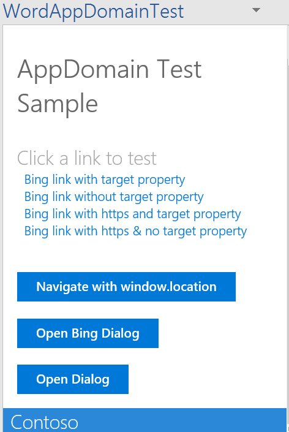

# appdomain-test-taskpane
Word Task Pane Add-in to use for testing behaviors of AppDomains

This Add-in was written to test the behavior of the Office Word Add-in when an AppDomain is or is not specified in the manifest. 

## Get Started

1. Download this repo
2. Open the Visual Studio solution file **your_repo/WordAppDomainTest/WordAppDomainTest.sln**.
3. In solution explorer, click the WordAppDomainTestWeb folder and copy the SSL URL in the Properties window. ie. https://localhost:44344
4. In Home.js, copy that SSL URL to the function openDialogtoPage with your localhost and make sure /page.html is included in the URL.
5. Run the add-in.

When you launch the task pane, you'll see different options to open https://www.bing.com. The add-in initially does not have any AppDomains specified. To specify an AppDomain, open the manifest file, and add an AppDomain element to the web page you choose, like https://www.bing.com.

